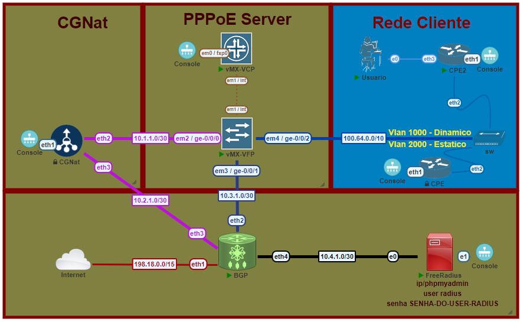
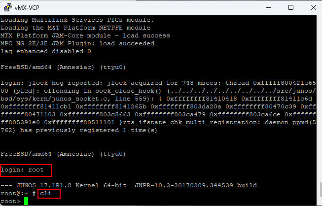
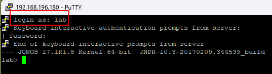
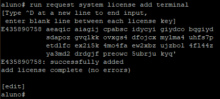
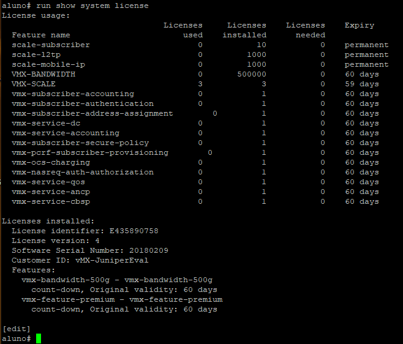
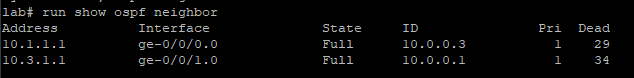

# Junos-BRAS-UNL

## Cenário

Este laboratório é sobre BRAS/BNG em Junos e todas as tarefas estão voltadas principalmente para juniper, portanto, os demais componentes do LAB estão somente para simular a conectividade que envolve um BRAS, sendo a configuração destes não aprofundada.

Foi utilizada a imagem para eve-ng do junos  [**17.1R1.8**](https://drive.google.com/drive/folders/11cEkLSjl3mPRLB2FF9Fe0oWUZfxEZKbs?usp=sharing)


Sendo assim, o BGP, a CPE do cliente e CGNAT estão representados por imagens Mikrotik, que farão o trabalho  simplificado para simbolizar os demais atores de uma rede.

Alguns equipamentos estão com uma interface conectada a uma Nuvem chamada **Console**, com a finalidade de facilitar o gerenciamento do equipamento através do emulador.

Como preparação, é preciso inicilizar todos os hosts e então realizar as configurações básicas, a fim de que haja conectividade de internet na VM BGP e que o protocolo ospf esteja rodando entre os 3 Roteadores.

> **Nota:** Inicialmente, testei o LAB utilizando eve-ng, entretanto, na ultima atualização, foi realizado no pnetlab, inclusive as ilustrações são deste ultimo.
## Preparação
  
* Ao iniciar o junos pela primeira vez, acesse com usuário `root` e deixa a senha em branco.
* Então, use o comando `cli` para entrar no modo de usuário e o comando `configure` para acessar o modo de configuração.



* Poderemos opcionalmente agora configurar um ip de gerencia na interface **fxp0**, para acessarmos por **ssh** e facilitar as configurações:

```sql
configure
set interfaces fxp0 description "Interface de Gerencia"
# Note que o IP abaixo é um endereço compativel com sua rede de gerencia
set interfaces fxp0 unit 0 family inet address 192.168.3.5/24
commit
```
> *É normal que no eve-ng a imagem do Junos demore MUITO tempo pra subir. Depende muito da performance da sua instalação*

* Desabilite o Auto upgrade para o log parar de perturbar:
```sql
delete chassis auto-image-upgrade
commit
```

 * Configure um usuário e habilite o acesso SSH. 
 
 > _Ao colar códigos no terminal, o console SSH suporta mais caracteres de entrada que o console serial, facilitando o desempenho do LAB. Então a ideia é acessar o router via ssh no ip que setamos previamente na interface fxp_

```php
######################################
## Criacao do Usuario e acesso remoto
######################################

## senha de root: lab123
deactivate system syslog user *
set system root-authentication plain-text-password

```
> O comando vai solicitar que crie a senha e confirme

```sql
## senha do usuario lab: lab123
set system login user lab class super-user
set system login user lab authentication plain-text-password
```
>Novamente crie a senha do usuario lab e confirme

Agora ativaremos o serviço ssh:
```sql
set system services ssh
commit
```

Agora podemos logar no junos pelo ip de gerencia, que vc deve *adequar* ao seu lab, basta conectar a **fxp0** na nuvem:


* Já podemos aplicar a licença de teste gratuita no JunOS, válida por 60 dias, que é tempo suficiente para explorar o LAB:

```java
request system license add terminal
```

* Cole a chave e, numa linha vazia, pressione **Ctrl + D** para confirmar:


```
E435890758 aeaqic aiagij cpabsc idycyi giydco bqgiyd
           sdapoz gvqlkk ovxgs4 dfojcx mylma4 uhfs7p
           etdlfc ex2i5k 4mo4fa ew2xbz ujzbol 4fl44z
           ya3md2 drdgjf preowc 5ubrju kyq'
```


* Podemos verificar a licença com o comando `show system license`


> Como se pode notar, a licença permite 10 assinantes simultaneos, suficientes para um laboratório.

* Configure os IPs nas interfaces para estabelecer conectividade e teste com ping


| Roteador      | Interface     | IPv4 | 
| ------------- | ---           | --- | 
| BGP           | lo0           | <span style="color:blue">10.0.0.1/32</span> | 
| BGP           | ether2        | 10.3.1.1/30 | 
| BGP           | ether3        | 10.2.1.2/30 | 
| BGP           | ether4        | 10.4.1.1/30 | 
| Juniper       | lo0           | <span style="color:blue">10.0.0.2/32</span> | 
| Juniper       | ge-0/0/0      | 10.1.1.2/30 | 
| Juniper       | ge-0/0/1      | 10.3.1.2/30 | 
| CGNat         | lo0           | <span style="color:blue">10.0.0.3/32</span> | 
| CGNat         | ether2        | 10.1.1.1/30 | 
| CGNat         | ether3        | 10.2.1.1/30 | 
| FreeRadius    | ens3          | 10.4.1.2/30 | 

* Comandos no Junos:

```sql
configure
top edit interfaces lo0 unit 0
set description "LOOPBACK"
set family inet address 10.0.0.2/32

top edit interfaces ge-0/0/0 unit 0
set description "CGNAT"
set family inet address 10.1.1.2/30

top edit interfaces ge-0/0/1 unit 0
set description "BGP"
set family inet address 10.3.1.2/30

commit
```
> Os comandos nas mikrotik ficam por sua conta ^^ 
> mas vc pode pegar uma colinha [aqui](mikrotik.md)

* Vamos estabelecer OSPF entre o CGNAT e o BRAS para que conheçam as rotas dos clientes PPPoE

> **Importante:** Diferentes profissionais utilizam diferentes técnicas em relação ao CGNAT. Neste lab, o CGNAT está conectado ao BRAS em vez do BGP para demostrar o uso de PBR no Junos, mas as topologias, bem como o uso se OSPF, BGP com as Privado ou rota estática com o CGNAT fica a critério do planejamento.

```sql
top set routing-options router-id 10.0.0.2
top set protocols ospf area 0.0.0.0 interface ge-0/0/0.0
top set protocols ospf area 0.0.0.0 interface ge-0/0/0.0 interface-type p2p
top set protocols ospf area 0.0.0.0 interface ge-0/0/1.0
top set protocols ospf area 0.0.0.0 interface ge-0/0/1.0 interface-type p2p
top set protocols ospf area 0.0.0.0 interface lo0.0 passive
commit
```

+ Após configurar os outros roteadores, basta testar se as rotas estão distribuidas


Até aqui, Temos os tres roteadores se cominucando. Vamos começar agora a parte que interessa: o BNG/BRAS propriamente dito!
## Configurações de BRAS ("Concentrador PPPoE")


* Primeiro vamos habilitar o gerenciamento de clientes na caixa. Será necessário reboot após estas configurações:

```sql
set system services subscriber-management enable
commit
run request system reboot

set chassis network-services enhanced-ip
set system configuration-database virtual-memory-mapping process-set subscriber-management fixed-size 52500
set system configuration-database virtual-memory-mapping process-set subscriber-management page-pooling-size 22500
set system configuration-database max-db-size 104857600
commit
```

* O Junos vai autenticar em um servidor Radius, portanto, vamos confiurar a conexão com Radius

```sql
## IP do Servidor Radius
top edit access radius-server 10.4.1.2
set port 1812
set accounting-port 1813
## senha do nas
set secret radius
top set access radius-disconnect-port 3799
top set access radius-disconnect 10.4.1.2
```

* O Junos trabalha com perfil de autenticação, isto é, perfil de acesso, é possivel utilizar mais de um perfil e, por exemplo, cada grupo de vlan utilizar um perfil diferente. 

Dito isto, neste exemplo vamos trabalhar com dois métodos de perfil dinâmico, onde no primeiro as configurações de firewall são dinâmicas e, no segundo, estáticas.

É importante lembrar que é preciso uma licença especial para utilizar o perfil de forma dinamica.

```
top edit access profile PPPoE-AAA-Profile
set authentication-order radius
set domain-name-server 8.8.8.8
set radius authentication-server 10.4.1.2 
set radius accounting-server 10.4.1.2
set radius options nas-port-extended-format slot-width 5
set radius options nas-port-extended-format adapter-width 1
set radius options nas-port-extended-format port-width 3
set radius options client-authentication-algorithm round-robin
set accounting order radius
set accounting accounting-stop-on-failure
set accounting accounting-stop-on-access-deny
set accounting immediate-update
set accounting coa-immediate-update
set accounting address-change-immediate-update
set accounting update-interval 120
set accounting statistics volume-time
commit
```

* Precisamos definir um domínio, assim o perfil de autenticação criado acima se torna o padrão

```
## Configurando dominio de acesso:
top edit access domain map default
## Qual perfil de acesso usar
set access-profile PPPoE-AAA-Profile
## Qual pool usar por padrao
set address-pool pool-1

## Global config
top
set system processes general-authentication-service traceoptions file radius
set system processes general-authentication-service traceoptions flag all
## Perfil de AAA padrao
set access-profile PPPoE-AAA-Profile
set protocols pppoe traceoptions file "log_pppoe"
set protocols pppoe traceoptions file files 5
set protocols pppoe traceoptions level notice
set protocols pppoe traceoptions flag all
commit
```

* Criando o Pool IPv4 

```
top edit access address-assignment
set pool pool-1 family inet network 100.64.0.0/10
set pool pool-suspenso family inet network 169.254.0.0/22
commit
```

### Controle de banda via Service Activate (Feature 35)

Nota: É necessário ter este feature ativado na licença

+ Primeiro, habilitar o versionamento de profile na caixa, assim, não será necessário derrubar todos os clientes quando fizer uma alteração no profile.

```
set system dynamic-profile-options versioning
```

* Vamos configurar um perfil dinâmico básico. Este perfil básico será iterado pelos "serviços" dinamicos que serão informado pelo Radius.

```
top edit dynamic-profiles PPPoE-Base
set routing-instances "$junos-routing-instance" interface "$junos-interface-name"
set routing-instances "$junos-routing-instance" routing-options access-internal route $junos-subscriber-ip-address qualified-next-hop "$junos-interface-name"
set interfaces pp0 unit "$junos-interface-unit" ppp-options chap
set interfaces pp0 unit "$junos-interface-unit" ppp-options pap
set interfaces pp0 unit "$junos-interface-unit" ppp-options mru 1500
set interfaces pp0 unit "$junos-interface-unit" ppp-options mtu 1500
set interfaces pp0 unit "$junos-interface-unit" pppoe-options underlying-interface "$junos-underlying-interface"
set interfaces pp0 unit "$junos-interface-unit" pppoe-options server
set interfaces pp0 unit "$junos-interface-unit" keepalives interval 60
set interfaces pp0 unit "$junos-interface-unit" family inet rpf-check
set interfaces pp0 unit "$junos-interface-unit" family inet unnumbered-address "$junos-loopback-interface"
top
commit

## Perfil para vlan demux?

set dynamic-profiles vlan-profile interfaces demux0 unit "$junos-interface-unit" vlan-id "$junos-vlan-id"
set dynamic-profiles vlan-profile interfaces demux0 unit "$junos-interface-unit" demux-options underlying-interface "$junos-interface-ifd-name"
set dynamic-profiles vlan-profile interfaces demux0 unit "$junos-interface-unit" family pppoe access-concentrator PPPoE-Base
set dynamic-profiles vlan-profile interfaces demux0 unit "$junos-interface-unit" family pppoe duplicate-protection
set dynamic-profiles vlan-profile interfaces demux0 unit "$junos-interface-unit" family pppoe dynamic-profile PPPoE-Base


```

* Sobe o servidor PPPoE com controle de banda dinamico na vlan 1000

```
top edit interfaces ge-0/0/2
set description CLIENTES-PPPOE
set flexible-vlan-tagging
edit unit 1000
set vlan-id 1000
set family pppoe access-concentrator VLAN1000
set family pppoe dynamic-profile PPPoE-Base
commit

## Comentar esta parte na doc:
ilunne@CORE-ACESSO> show configuration interfaces xe-0/0/3 | display set
set description CLIENTES-PPPOE
set flexible-vlan-tagging
set auto-configure vlan-ranges dynamic-profile vlan-profile accept pppoe
set auto-configure vlan-ranges dynamic-profile vlan-profile ranges any
set auto-configure vlan-ranges override
set auto-configure vlan-ranges access-profile PPPoE-Access-Profile
set auto-configure remove-when-no-subscribers
set encapsulation flexible-ethernet-services


```

* Cria o Serviço que será passado pelo Radius, com Variáveis, para IPv4

```
top edit dynamic-profiles IPV4
set variables Bandwidth-IN default-value 32k
set variables Bandwidth-IN mandatory
set variables Bandwidth-OUT default-value 32k
set variables Bandwidth-OUT mandatory
set variables Burst-IN default-value 2m
set variables Burst-OUT default-value 2m
set variables Policer-IN uid
set variables Policer-OUT uid
set variables Filter-IN uid
set variables Filter-OUT uid
set interfaces pp0 unit "$junos-interface-unit" family inet filter input "$Filter-IN"
set interfaces pp0 unit "$junos-interface-unit" family inet filter output "$Filter-OUT"
set firewall family inet filter "$Filter-IN" interface-specific
set firewall family inet filter "$Filter-IN" term 10 then policer "$Policer-IN"
set firewall family inet filter "$Filter-IN" term 10 then accept
set firewall family inet filter "$Filter-OUT" interface-specific
set firewall family inet filter "$Filter-OUT" term 10 then policer "$Policer-OUT"
set firewall family inet filter "$Filter-OUT" term 10 then accept
set firewall policer "$Policer-IN" logical-interface-policer
set firewall policer "$Policer-IN" if-exceeding bandwidth-limit "$Bandwidth-IN"
set firewall policer "$Policer-IN" if-exceeding burst-size-limit "$Burst-IN"
set firewall policer "$Policer-IN" then discard
set firewall policer "$Policer-OUT" logical-interface-policer
set firewall policer "$Policer-OUT" if-exceeding bandwidth-limit "$Bandwidth-OUT"
set firewall policer "$Policer-OUT" if-exceeding burst-size-limit "$Burst-OUT"
set firewall policer "$Policer-OUT" then discard
top
commit
```

Feito isto, a caixa já deve estar capaz de autenticar um cliente e entregar um ip através do pool padrão definido acima. porém ainda não funciona com ipv6.


## Freeradius


Criei uma vm simplificada com freeradius3 para utilizar somente neste LAB, utilizando este tutorial: https://blog.remontti.com.br/2066.

Credenciais necessárias para possiveis testes: 

| Plataforma | Usuário | Senha | 
| ------------- | --- | --- | 
| linux | root | eve | 
| phpmyadmin | radius | SENHA-DO-USER-RADIUS |
| mysql | root | SUA-SENHA-USER-ROOT | 


Para fazer que o radius aceite qualquer ip deste lab, eu editei o arquivo `/etc/freeradius/3.0/clients.conf` e adicionei o seguinte:
 
```
client LAB {
        ipaddr          = 10.0.0.0/8
        secret          = radius
}
```

Nas tabelas radcheck, radusergroup e radgroupreply inseri estes dados:

```
INSERT INTO `radcheck` (`id`, `username`, `attribute`, `op`, `value`) VALUES
(1, 'teste1', 'Cleartext-Password', ':=', 'teste1'),
(2, 'teste2', 'Cleartext-Password', ':=', 'teste2');

INSERT INTO `radusergroup` (`username`, `groupname`, `priority`) VALUES
('teste1', 'FTTH_025M', 1),
('teste2', 'FTTH_050M', 1);

INSERT INTO `radgroupreply` (`id`, `groupname`, `attribute`, `op`, `value`) VALUES
(1, 'FTTH_025M', 'ERX-Service-Activate:1', '=', '\"IPV4(20M,30M)\"'),
(2, 'FTTH_050M', 'ERX-Service-Activate:1', '=', '\"IPV4(30M,50M)\"'),
(3, 'FTTH_050M', 'ERX-Service-Activate:2', '=', '\"IPV6(30M,50M)\"');
```

Tudo certo, funcionando!

Agora podemos implementar IPv6 e depois os planos estáticos.

## IMPLEMENTAÇÃO DE IPV6


* Antes de tudo vamos configurar um IPv6 na loopback

```
set interfaces lo0 unit 0 family inet6 address 2804:face:b00c::1/128 preferred
```

+ Agora vamos tratar a parte de roteamento em ipv6:

* Devemos incluir a interface que conecta no bgp na area 0.0.0.0, bem como atribuir um ip global a esta interface:

```
top edit interfaces ge-0/0/1 unit 0
set family inet6 address 2804:2b28:2000:200::2/64
top set protocols ospf3 area 0.0.0.0 interface ge-0/0/1.0
```

+ Depois devemos criar o filtro para publicar as rotas no ospf3. Neste filtro, o primeiro termo Sumariza o Pool Configurado no junos e o segundo termo aceita os demais prefixos que sejam entregues via Radius

```
top 
set protocols ospf3 export Export_OSPF

top edit policy-options policy-statement Export_OSPF
edit term Sumarizar
set from route-filter 2804:2b28:440::/44 exact accept
set from route-filter 2804:2b28:440::/44 orlonger reject
set then accept
## Propagar também as rotas conectadas:
up 
edit term 2
set from protocol access
set then accept
top
```

+ Publicar a rota de Blackhole da pool ipv6 empregado:

```
set routing-options rib inet6.0 static route 2804:2b28:440::/44 discard
```

### Ajustes especificos para IPv6


* Primeiro vamos ajustar o ipv6 no perfil base:

```
top edit dynamic-profiles PPPoE-Base
set interfaces pp0 unit "$junos-interface-unit" family inet6 address $junos-ipv6-address
set interfaces pp0 unit "$junos-interface-unit" family inet6 unnumbered-address "$junos-loopback-interface"
set protocols router-advertisement interface "$junos-interface-name" prefix $junos-ipv6-ndra-prefix
```

* Ajustando perfil de autenticacao para IPv6:

```
top edit access profile PPPoE-AAA-Profile
set domain-name-server-inet6 2001:4860:4860::8888
set domain-name-server-inet6 2001:4860:4860::8844
top
```

* Criando o Pool IPv6 

```
top edit access address-assignment
set neighbor-discovery-router-advertisement ndra

set pool ndra family inet6 prefix 2804:2b28:450::/44
set pool ndra family inet6 range ndra-range prefix-length 64

set pool v6-pool-1 family inet6 prefix 2804:2b28:440::/44
set pool v6-pool-1 family inet6 range prefix-range prefix-length 56

commit
```

* Configura um Servidor DHCPv6

```
top edit system services dhcp-local-server dhcpv6
set overrides delegated-pool v6-pool-1
set overrides multi-address-embedded-option-response
set group group-pppoe interface pp0.0
top
commit
```
 
Feito isso, já está rodando ipv6 no cliente, basta o CPE solicitar via **dhcp-client**

Para aplicar politicas de firewall dinamicamente, basta informar via Radius um novo **Service-Activate**

+ Cria o modelo que será passado pelo Radius, com Variáveis, para IPv6 

``` 
top edit dynamic-profiles IPV6
set variables Bandwidth-IN-V6 default-value 32k
set variables Bandwidth-IN-V6 mandatory
set variables Bandwidth-OUT-V6 default-value 32k
set variables Bandwidth-OUT-V6 mandatory
set variables Burst-IN-V6 default-value 2m
set variables Burst-OUT-V6 default-value 2m
set variables Policer-IN-V6 uid
set variables Policer-OUT-V6 uid
set variables Filter-IN-V6 uid
set variables Filter-OUT-V6 uid
set interfaces pp0 unit "$junos-interface-unit" family inet6 filter input "$Filter-IN-V6"
set interfaces pp0 unit "$junos-interface-unit" family inet6 filter output "$Filter-OUT-V6"
set firewall family inet6 filter "$Filter-IN-V6" interface-specific
set firewall family inet6 filter "$Filter-IN-V6" term 10 then policer "$Policer-IN-V6"
set firewall family inet6 filter "$Filter-IN-V6" term 10 then accept
set firewall family inet6 filter "$Filter-OUT-V6" interface-specific
set firewall family inet6 filter "$Filter-OUT-V6" term 10 then policer "$Policer-OUT-V6"
set firewall family inet6 filter "$Filter-OUT-V6" term 10 then accept
set firewall policer "$Policer-IN-V6" logical-interface-policer
set firewall policer "$Policer-IN-V6" if-exceeding bandwidth-limit "$Bandwidth-IN-V6"
set firewall policer "$Policer-IN-V6" if-exceeding burst-size-limit "$Burst-IN-V6"
set firewall policer "$Policer-IN-V6" then discard
set firewall policer "$Policer-OUT-V6" logical-interface-policer
set firewall policer "$Policer-OUT-V6" if-exceeding bandwidth-limit "$Bandwidth-OUT-V6"
set firewall policer "$Policer-OUT-V6" if-exceeding burst-size-limit "$Burst-OUT-V6"
set firewall policer "$Policer-OUT-V6" then discard
top
commit
```


### Controle de Banda via policy Estática

 
+ Para quem não tem a licença para configurar os planos de forma dinâmica, deverá criar uma configuração para CADA plano, e esta configuração deverá ser passada pelo Radius
 
+ Então, criaremos um Serviço e ele será aplicado na Vlan 2000
 
```
top edit dynamic-profiles PPPoE-Estatico
set routing-instances "$junos-routing-instance" interface "$junos-interface-name"
set routing-instances "$junos-routing-instance" routing-options access-internal route $junos-subscriber-ip-address qualified-next-hop "$junos-interface-name"
set interfaces pp0 unit "$junos-interface-unit" ppp-options chap
set interfaces pp0 unit "$junos-interface-unit" ppp-options pap
set interfaces pp0 unit "$junos-interface-unit" ppp-options mru 1500
set interfaces pp0 unit "$junos-interface-unit" ppp-options mtu 1500
set interfaces pp0 unit "$junos-interface-unit" pppoe-options underlying-interface "$junos-underlying-interface"
set interfaces pp0 unit "$junos-interface-unit" pppoe-options server
set interfaces pp0 unit "$junos-interface-unit" keepalives interval 60
set interfaces pp0 unit "$junos-interface-unit" family inet rpf-check
set interfaces pp0 unit "$junos-interface-unit" family inet unnumbered-address "$junos-loopback-interface"

## São estas configurações abaixo que garantem o funcionamento da policy
set family inet filter input "$junos-input-filter"
set family inet filter output "$junos-output-filter"
set family inet6 filter input "$junos-input-ipv6-filter"
set family inet6 filter output "$junos-output-ipv6-filter"
```

+ Abaixo, criando o plano de 10M, para cada plano novo, copiar e fazer as alterações necessárias

```
###################################################################################################
## Exemplo que cria os planos baseados em Trafic Chaping estáticos
###################################################################################################

## Queue 10M
top edit firewall policer 10M-out-rate 
## Download do cliente
set if-exceeding bandwidth-limit 10M
set if-exceeding burst-size-limit 1M
set then discard
top edit firewall policer 10M-in-rate 
## Upload do Cliente
set if-exceeding bandwidth-limit 4M
set if-exceeding burst-size-limit 500k
set then discard

## PLANO de 10M
top edit firewall filter OUT-10M
set interface-specific
set term 1 filter residencial-output 
## politica de firewall proteger cliente
set term 3 then policer 10M-out-rate 
## queue de download
set term 3 then accept
top edit firewall filter IN-10M
set interface-specific
set term 1 filter residencial-input 
## politica de firewall proibir cliente
set term 3 then policer 10M-in-rate 
## queue de upload
set term 3 then accept

###################################################################################################
## Define as politicas de firewall
###################################################################################################

## Politicas do que o cliente pode acessar externamente
top edit firewall family inet filter residencial-input
set term NetBios from protocol tcp
set term NetBios from protocol udp
set term NetBios from port 135-139
set term NetBios from port 445
set term NetBios then discard
## Politicas para proteger o cliente
top edit firewall family inet filter residencial-output
set term NetBios from protocol tcp
set term NetBios from protocol udp
set term NetBios from port 135-139
set term NetBios from port 445
set term NetBios then discard
set term PortasBaixas from protocol tcp
set term PortasBaixas from destination-port 1-1024
set term PortasBaixas then discard

```


## Anotações

*Por algum motivo, com a configuração acima não está funcionando, então configurei de forma estatica a vlan 1000:
```
set auto-configure stacked-vlan-ranges dynamic-profile PPPoE-Base accept pppoe
set auto-configure stacked-vlan-ranges dynamic-profile PPPoE-Base ranges any,any
set auto-configure stacked-vlan-ranges override
set auto-configure vlan-ranges dynamic-profile PPPoE-Base accept pppoe
set auto-configure vlan-ranges dynamic-profile PPPoE-Base ranges any
set auto-configure vlan-ranges override
set auto-configure vlan-ranges access-profile PPPoE-AAA-Profile
set auto-configure remove-when-no-subscribers
set encapsulation flexible-ethernet-services
commit
run request system reboot


set system ddos-protection protocols pppoe padi bandwidth 25
set system ddos-protection protocols pppoe padi burst 10
set system ddos-protection protocols pppoe padi recover-time 10
set system ddos-protection protocols pppoe padi priority low
set system ddos-protection protocols pppoe pado bandwidth 25
set system ddos-protection protocols pppoe pado burst 10
set system ddos-protection protocols pppoe pado recover-time 10
set system ddos-protection protocols pppoe pado priority low
set system ddos-protection protocols pppoe padr bandwidth 25
set system ddos-protection protocols pppoe padr burst 10
set system ddos-protection protocols pppoe padr recover-time 10
set system ddos-protection protocols pppoe padr priority low
set system ddos-protection protocols pppoe pads bandwidth 25
set system ddos-protection protocols pppoe pads burst 10
set system ddos-protection protocols pppoe pads recover-time 10
set system ddos-protection protocols pppoe pads priority low
set system ddos-protection protocols pppoe padt bandwidth 25
set system ddos-protection protocols pppoe padt burst 10
set system ddos-protection protocols pppoe padt recover-time 10
set system ddos-protection protocols pppoe padt priority low
set system ddos-protection protocols dhcpv4 aggregate disable-fpc
set system ddos-protection protocols dhcpv4 bad-packets disable-fpc
set system ddos-protection protocols icmp aggregate disable-routing-engine
set system ddos-protection protocols icmp aggregate disable-fpc
set system ddos-protection protocols arp aggregate disable-routing-engine
set system ddos-protection protocols arp aggregate disable-fpc
set system ddos-protection protocols ttl aggregate disable-routing-engine
set system ddos-protection protocols ttl aggregate disable-fpc
set system ddos-protection protocols ntp aggregate disable-fpc
set system ddos-protection protocols ip-fragments first-fragment disable-fpc
set system ddos-protection protocols ip-fragments trail-fragment disable-fpc


