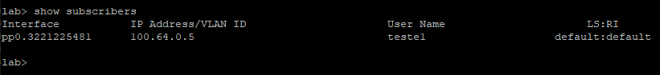
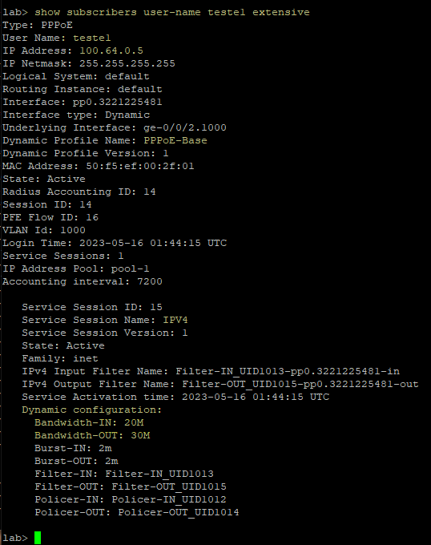

Criei uma vm simplificada com freeradius3 para utilizar somente neste LAB, utilizando estes tutoriais: 
- https://blog.remontti.com.br/2066
- https://blog.remontti.com.br/4085

Download da VM para eve-ng/pnetlab:
- [link](https://drive.google.com/drive/folders/1gc4C__nOHeNEQkKmJoyEvYnSyj7TLSgT?usp=sharing)

Credenciais necessárias para possiveis testes: 

| Plataforma | Usuário | Senha | 
| ------------- | --- | --- | 
| linux | root | eve | 
| phpmyadmin | radius | SENHA-DO-USER-RADIUS |
| mysql | root | SUA-SENHA-USER-ROOT | 


Para fazer que o radius aceite *qualquer ip* neste lab, não sendo necessário adicionar o cliente no banco de dados, eu editei o arquivo `/etc/freeradius/3.0/clients.conf` e adicionei o seguinte:
 
```php
client LAB {
        ipaddr          = 10.0.0.0/8
        secret          = radius
}
```

Porém, o recomendado é adicionar o cliente no banco:
```sql
INSERT INTO `nas` (`nasname`, `shortname`, `type`, `ports`, `secret`, `server`, `community`, `description`) VALUES
-- Juniper --
('10.3.1.2', 'Junos', 'other', NULL, 'radius', NULL, NULL, 'JUN PPPoE')
```

Nas tabelas radcheck, radusergroup e radgroupreply inseri estes dados:

```sql
INSERT INTO `radcheck` (`id`, `username`, `attribute`, `op`, `value`) VALUES
(1, 'teste1', 'Cleartext-Password', ':=', 'teste1'),
(2, 'teste2', 'Cleartext-Password', ':=', 'teste2');

INSERT INTO `radusergroup` (`username`, `groupname`, `priority`) VALUES
('teste1', 'FTTH_025M', 1),
('teste2', 'FTTH_050M', 1);

INSERT INTO `radgroupreply` (`id`, `groupname`, `attribute`, `op`, `value`) VALUES
(1, 'FTTH_025M', 'ERX-Service-Activate:1', '=', '\"IPV4(20M,30M)\"'),
(2, 'FTTH_050M', 'ERX-Service-Activate:1', '=', '\"IPV4(30M,50M)\"'),
(3, 'FTTH_050M', 'ERX-Service-Activate:2', '=', '\"IPV6(30M,50M)\"');

INSERT INTO nas (nasname, shortname, type, secret, server, community, description)
VALUES ('10.0.0.2', 'Junos', 'cisco', 'radius', NULL, NULL, 'Roteador de laboratorio');
```

Podemos testar no Junos se a conexão com a Radius está ok:

```bash
lab> test aaa ppp user teste2 password teste2
    Authentication Deny
    Reason : CONFIGURATION ERROR
    Received Attributes :
         User Name -                              teste2
         Virtual Router Name (LS:RI) -            default:default
         Service Type -                           Framed
         Agent Remote Id -                        <not set>
         Client IP Address -                      100.64.0.2
         Client IP Netmask -                      255.255.255.255
         Primary DNS IP Address -                 8.8.8.8
         Secondary DNS IP Address -               <not set>
         Primary WINS IP Address -                <not set>
         Secondary WINS IP Address -              <not set>
         Primary DNS IPv6 Address  -              <not set>
         Secondary DNS IPv6 Address  -            <not set>
         Reply Message -                          <not set>
         Class Attribute -                        <not set>
         Framed Pool -                            pool-1
         Client IPv6 Address -                    <not set>
         Client IPv6 Mask -                       <not set>
         Framed IPv6 Prefix -                     <not set>
         Framed IPv6 Pool -                       <not set>
         NDRA IPv6 Prefix -                       <not set>
         Login IPv6 Host -                        <not set>
         Framed Interface Id -                    <not set>
         Delegated IPv6 Prefix -                  <not set>
         Delegated IPv6 Pool -                    <not set>
         User Password -                          teste2
         CHAP Password -                          <not set>
         NAS Ip Address -                         <not set>
         Mac Address -                            AB:CD:00:00:00:01
         Service Name (1) -                       IPV4(30M,50M)IPV4(30M,50M)
         Service Name (2) -                       IPV6(30M,50M)IPV6(30M,50M)
         Idle Timeout -                           <not set>
         Session Timeout -                        <not set>
         Cos shaping rate -                       <not set>
         Cos scheduler param -                    <not set>
         Ingress Policy Name -                    <not set>
         Egress Policy Name -                     <not set>
         Redirect VR Name (LS:RI) -               <not set>
         Service Bundle -                         <not set>
         IGMP Enable -                            <not set>
         IGMP Version -                           <not set>
         MLD Version -                            <not set>
         IGMP Immediate Leave -                   <not set>
         MLD Immediate Leave -                    <not set>
         IPv6 Ingress Policy Name -               <not set>
         IPv6 Egress Policy Name -                <not set>
         Dynamic Profile -                        junos-default-profile
         Acct Session ID -                        3
         Acct Interim Interval -                  <not set>
         Acct Type -                              <not set>
         Chargeable user identity -               <not set>
         NAS Port Id -                            <not set>
         NAS Port -                               0
         NAS Port Type -                          15
         Framed Protocol -                        1
    Test complete. Exiting

lab>
```
Perceba que apesar de dar DENY, obtivemos resposta do Radius!

Agora, A título de Curiosidade, se vc Iniciar o freeradius em modo de depuração, poderá ver detalhadamente o processo de autenticação:

```bash
Ready to process requests
(0) Received Access-Request Id 46 from 10.0.0.2:56366 to 10.4.1.2:1812 length 161
(0)   User-Name = "teste1"
(0)   User-Password = "teste1"
(0)   Service-Type = Framed-User
(0)   Framed-Protocol = PPP
(0)   Chargeable-User-Identity = 0x00
(0)   Acct-Session-Id = "4"
(0)   Calling-Station-Id = "50-f5-ef-00-2f-01"
(0)   ERX-Dhcp-Mac-Addr = "50f5.ef00.2f01"
(0)   NAS-Port = 16777216
(0)   NAS-Port-Id = ":1000"
(0)   NAS-Port-Type = Ethernet
(0)   ERX-Pppoe-Description = "pppoe 50:f5:ef:00:2f:01"
(0)   NAS-IP-Address = 10.0.0.2
(0) # Executing section authorize from file /etc/freeradius/3.0/sites-enabled/default
(0)   authorize {
(0)     policy filter_username {
(0)       if (&User-Name) {
(0)       if (&User-Name)  -> TRUE
(0)       if (&User-Name)  {
(0)         if (&User-Name =~ / /) {
(0)         if (&User-Name =~ / /)  -> FALSE
(0)         if (&User-Name =~ /@[^@]*@/ ) {
(0)         if (&User-Name =~ /@[^@]*@/ )  -> FALSE
(0)         if (&User-Name =~ /\.\./ ) {
(0)         if (&User-Name =~ /\.\./ )  -> FALSE
(0)         if ((&User-Name =~ /@/) && (&User-Name !~ /@(.+)\.(.+)$/))  {
(0)         if ((&User-Name =~ /@/) && (&User-Name !~ /@(.+)\.(.+)$/))   -> FALSE
(0)         if (&User-Name =~ /\.$/)  {
(0)         if (&User-Name =~ /\.$/)   -> FALSE
(0)         if (&User-Name =~ /@\./)  {
(0)         if (&User-Name =~ /@\./)   -> FALSE
(0)       } # if (&User-Name)  = notfound
(0)     } # policy filter_username = notfound
(0)     [preprocess] = ok
(0)     [chap] = noop
(0)     [mschap] = noop
(0) eap: No EAP-Message, not doing EAP
(0)     [eap] = noop
(0) sql: EXPAND %{User-Name}
(0) sql:    --> teste1
(0) sql: SQL-User-Name set to 'teste1'
rlm_sql (sql): Reserved connection (1)
(0) sql: EXPAND SELECT id, username, attribute, value, op FROM radcheck WHERE username = '%{SQL-User-Name}' ORDER BY id
(0) sql:    --> SELECT id, username, attribute, value, op FROM radcheck WHERE username = 'teste1' ORDER BY id
(0) sql: Executing select query: SELECT id, username, attribute, value, op FROM radcheck WHERE username = 'teste1' ORDER BY id
(0) sql: User found in radcheck table
(0) sql: Conditional check items matched, merging assignment check items
(0) sql:   Cleartext-Password := "teste1"
(0) sql: EXPAND SELECT id, username, attribute, value, op FROM radreply WHERE username = '%{SQL-User-Name}' ORDER BY id
(0) sql:    --> SELECT id, username, attribute, value, op FROM radreply WHERE username = 'teste1' ORDER BY id
(0) sql: Executing select query: SELECT id, username, attribute, value, op FROM radreply WHERE username = 'teste1' ORDER BY id
(0) sql: EXPAND SELECT groupname FROM radusergroup WHERE username = '%{SQL-User-Name}' ORDER BY priority
(0) sql:    --> SELECT groupname FROM radusergroup WHERE username = 'teste1' ORDER BY priority
(0) sql: Executing select query: SELECT groupname FROM radusergroup WHERE username = 'teste1' ORDER BY priority
(0) sql: User found in the group table
(0) sql: EXPAND SELECT id, groupname, attribute, Value, op FROM radgroupcheck WHERE groupname = '%{SQL-Group}' ORDER BY id
(0) sql:    --> SELECT id, groupname, attribute, Value, op FROM radgroupcheck WHERE groupname = 'FTTH_025M' ORDER BY id
(0) sql: Executing select query: SELECT id, groupname, attribute, Value, op FROM radgroupcheck WHERE groupname = 'FTTH_025M' ORDER BY id
(0) sql: Group "FTTH_025M": Conditional check items matched
(0) sql: Group "FTTH_025M": Merging assignment check items
(0) sql: EXPAND SELECT id, groupname, attribute, value, op FROM radgroupreply WHERE groupname = '%{SQL-Group}' ORDER BY id
(0) sql:    --> SELECT id, groupname, attribute, value, op FROM radgroupreply WHERE groupname = 'FTTH_025M' ORDER BY id
(0) sql: Executing select query: SELECT id, groupname, attribute, value, op FROM radgroupreply WHERE groupname = 'FTTH_025M' ORDER BY id
(0) sql: Group "FTTH_025M": Merging reply items
(0) sql:   ERX-Service-Activate:1 = "IPV4(20M,30M)"
rlm_sql (sql): Released connection (1)
rlm_sql (sql): Need 4 more connections to reach 10 spares
rlm_sql (sql): Opening additional connection (6), 1 of 26 pending slots used
rlm_sql_mysql: Starting connect to MySQL server
rlm_sql_mysql: Connected to database 'radius' on Localhost via UNIX socket, server version 10.1.37-MariaDB-0+deb9u1, protocol version 10
(0)     [sql] = ok
(0)     [expiration] = noop
(0)     [logintime] = noop
(0)     [pap] = updated
(0)   } # authorize = updated
(0) Found Auth-Type = PAP
(0) # Executing group from file /etc/freeradius/3.0/sites-enabled/default
(0)   Auth-Type PAP {
(0) pap: Login attempt with password
(0) pap: Comparing with "known good" Cleartext-Password
(0) pap: User authenticated successfully
(0)     [pap] = ok
(0)   } # Auth-Type PAP = ok
(0) # Executing section post-auth from file /etc/freeradius/3.0/sites-enabled/default
(0)   post-auth {
(0)     update {
(0)       No attributes updated
(0)     } # update = noop
(0) sql: EXPAND .query
(0) sql:    --> .query
(0) sql: Using query template 'query'
rlm_sql (sql): Reserved connection (2)
(0) sql: EXPAND %{User-Name}
(0) sql:    --> teste1
(0) sql: SQL-User-Name set to 'teste1'
(0) sql: EXPAND INSERT INTO radpostauth (username, pass, reply, authdate) VALUES ( '%{SQL-User-Name}', '%{%{User-Password}:-%{Chap-Password}}', '%{reply:Packet-Type}', '%S')
(0) sql:    --> INSERT INTO radpostauth (username, pass, reply, authdate) VALUES ( 'teste1', 'teste1', 'Access-Accept', '2023-05-15 22:40:11')
(0) sql: Executing query: INSERT INTO radpostauth (username, pass, reply, authdate) VALUES ( 'teste1', 'teste1', 'Access-Accept', '2023-05-15 22:40:11')
(0) sql: SQL query returned: success
(0) sql: 1 record(s) updated
rlm_sql (sql): Released connection (2)
(0)     [sql] = ok
(0) sqlippool: No Pool-Name defined
(0) sqlippool: EXPAND No Pool-Name defined (did %{Called-Station-Id} cli %{Calling-Station-Id} port %{NAS-Port} user %{User-Name})
(0) sqlippool:    --> No Pool-Name defined (did  cli 50-f5-ef-00-2f-01 port 16777216 user teste1)
(0)     [sqlippool] = noop
(0)     policy remove_reply_message_if_eap {
(0)       if (&reply:EAP-Message && &reply:Reply-Message) {
(0)       if (&reply:EAP-Message && &reply:Reply-Message)  -> FALSE
(0)       else {
(0)         [noop] = noop
(0)       } # else = noop
(0)     } # policy remove_reply_message_if_eap = noop
(0)   } # post-auth = ok
(0) Sent Access-Accept Id 46 from 10.4.1.2:1812 to 10.0.0.2:56366 length 0
(0)   ERX-Service-Activate:1 = "IPV4(20M,30M)"
(0) Finished request
Waking up in 4.9 seconds.
(1) Received Accounting-Request Id 47 from 10.0.0.2:56366 to 10.4.1.2:1813 length 227
(1)   User-Name = "teste1"
(1)   Acct-Status-Type = Start
(1)   Acct-Session-Id = "4"
(1)   Event-Timestamp = "May 15 2023 22:40:12 -03"
(1)   Acct-Delay-Time = 0
(1)   Service-Type = Framed-User
(1)   Framed-Protocol = PPP
(1)   Attr-26.4874.177 = 0x506f72742073706565643a20313030303030306b
(1)   Acct-Authentic = RADIUS
(1)   Calling-Station-Id = "50-f5-ef-00-2f-01"
(1)   ERX-Dhcp-Mac-Addr = "50f5.ef00.2f01"
(1)   Framed-IP-Address = 100.64.0.3
(1)   Framed-IP-Netmask = 255.255.255.255
(1)   NAS-Port = 16777216
(1)   NAS-Port-Id = ":1000"
(1)   NAS-Port-Type = Ethernet
(1)   ERX-Virtual-Router-Name = "default:default"
(1)   ERX-Pppoe-Description = "pppoe 50:f5:ef:00:2f:01"
(1)   NAS-IP-Address = 10.0.0.2
(1) # Executing section preacct from file /etc/freeradius/3.0/sites-enabled/default
(1)   preacct {
(1)     [preprocess] = ok
(1)     policy acct_unique {
(1)       update request {
(1)         Tmp-String-9 := "ai:"
(1)       } # update request = noop
(1)       if (("%{hex:&Class}" =~ /^%{hex:&Tmp-String-9}/) &&       ("%{string:&Class}" =~ /^ai:([0-9a-f]{32})/i)) {
(1)       EXPAND %{hex:&Class}
(1)          -->
(1)       EXPAND ^%{hex:&Tmp-String-9}
(1)          --> ^61693a
(1)       if (("%{hex:&Class}" =~ /^%{hex:&Tmp-String-9}/) &&       ("%{string:&Class}" =~ /^ai:([0-9a-f]{32})/i))  -> FALSE
(1)       else {
(1)         update request {
(1)           EXPAND %{md5:%{User-Name},%{Acct-Session-ID},%{%{NAS-IPv6-Address}:-%{NAS-IP-Address}},%{NAS-Identifier},%{NAS-Port-ID},%{NAS-Port}}
(1)              --> 2ec0ab35ab69de0ec1b1cd01cdad817a
(1)           &Acct-Unique-Session-Id := 2ec0ab35ab69de0ec1b1cd01cdad817a
(1)         } # update request = noop
(1)       } # else = noop
(1)     } # policy acct_unique = noop
(1)   } # preacct = ok
(1) # Executing section accounting from file /etc/freeradius/3.0/sites-enabled/default
(1)   accounting {
(1) detail: EXPAND /var/log/freeradius/radacct/%{%{Packet-Src-IP-Address}:-%{Packet-Src-IPv6-Address}}/detail-%Y%m%d
(1) detail:    --> /var/log/freeradius/radacct/10.0.0.2/detail-20230515
(1) detail: /var/log/freeradius/radacct/%{%{Packet-Src-IP-Address}:-%{Packet-Src-IPv6-Address}}/detail-%Y%m%d expands to /var/log/freeradius/radacct/10.0.0.2/detail-20230515
(1) detail: EXPAND %t
(1) detail:    --> Mon May 15 22:40:13 2023
(1)     [detail] = ok
(1)     [unix] = ok
(1) sql: EXPAND %{tolower:type.%{Acct-Status-Type}.query}
(1) sql:    --> type.start.query
(1) sql: Using query template 'query'
rlm_sql (sql): Reserved connection (3)
(1) sql: EXPAND %{User-Name}
(1) sql:    --> teste1
(1) sql: SQL-User-Name set to 'teste1'
(1) sql: EXPAND INSERT INTO radacct (acctsessionid,             acctuniqueid,           username, realm,       nasipaddress,            nasportid, nasporttype,         acctstarttime,          acctupdatetime, acctstoptime,  acctsessiontime,         acctauthentic, connectinfo_start,       connectinfo_stop,       acctinputoctets, acctoutputoctets,      calledstationid,        callingstationid, acctterminatecause,   servicetype,            framedprotocol, framedipaddress) VALUES ('%{Acct-Session-Id}', '%{Acct-Unique-Session-Id}', '%{SQL-User-Name}', '%{Realm}', '%{NAS-IP-Address}', '%{%{NAS-Port-ID}:-%{NAS-Port}}', '%{NAS-Port-Type}', FROM_UNIXTIME(%{integer:Event-Timestamp}), FROM_UNIXTIME(%{integer:Event-Timestamp}), NULL, '0', '%{Acct-Authentic}', '%{Connect-Info}', '', '0', '0', '%{Called-Station-Id}', '%{Calling-Station-Id}', '', '%{Service-Type}', '%{Framed-Protocol}', '%{Framed-IP-Address}')
(1) sql:    --> INSERT INTO radacct (acctsessionid,             acctuniqueid,           username, realm,       nasipaddress,            nasportid, nasporttype,         acctstarttime,          acctupdatetime, acctstoptime,  acctsessiontime,         acctauthentic, connectinfo_start,       connectinfo_stop,       acctinputoctets, acctoutputoctets,      calledstationid,        callingstationid, acctterminatecause,   servicetype,            framedprotocol, framedipaddress) VALUES ('4', '2ec0ab35ab69de0ec1b1cd01cdad817a', 'teste1', '', '10.0.0.2', ':1000', 'Ethernet', FROM_UNIXTIME(1684201212), FROM_UNIXTIME(1684201212), NULL, '0', 'RADIUS', '', '', '0', '0', '', '50-f5-ef-00-2f-01', '', 'Framed-User', 'PPP', '100.64.0.3')
(1) sql: Executing query: INSERT INTO radacct (acctsessionid,           acctuniqueid,           username, realm,nasipaddress,           nasportid, nasporttype,         acctstarttime,          acctupdatetime, acctstoptime,  acctsessiontime,         acctauthentic, connectinfo_start,       connectinfo_stop,       acctinputoctets, acctoutputoctets,      calledstationid,        callingstationid, acctterminatecause,   servicetype,            framedprotocol, framedipaddress) VALUES ('4', '2ec0ab35ab69de0ec1b1cd01cdad817a', 'teste1', '', '10.0.0.2', ':1000', 'Ethernet', FROM_UNIXTIME(1684201212), FROM_UNIXTIME(1684201212), NULL, '0', 'RADIUS', '', '', '0', '0', '', '50-f5-ef-00-2f-01', '', 'Framed-User', 'PPP', '100.64.0.3')
(1) sql: SQL query returned: success
(1) sql: 1 record(s) updated
rlm_sql (sql): Released connection (3)
rlm_sql (sql): Need 3 more connections to reach 10 spares
rlm_sql (sql): Opening additional connection (7), 1 of 25 pending slots used
rlm_sql_mysql: Starting connect to MySQL server
rlm_sql_mysql: Connected to database 'radius' on Localhost via UNIX socket, server version 10.1.37-MariaDB-0+deb9u1, protocol version 10
(1)     [sql] = ok
rlm_sql (sql): Reserved connection (4)
(1) sqlippool: EXPAND %{User-Name}
(1) sqlippool:    --> teste1
(1) sqlippool: SQL-User-Name set to 'teste1'
(1) sqlippool: EXPAND START TRANSACTION
(1) sqlippool:    --> START TRANSACTION
(1) sqlippool: Executing query: START TRANSACTION
(1) sqlippool: EXPAND UPDATE radippool SET expiry_time = NOW() + INTERVAL 3600 SECOND WHERE nasipaddress = '%{NAS-IP-Address}' AND pool_key = '%{Calling-Station-Id}' AND username = '%{User-Name}' AND callingstationid = '%{Calling-Station-Id}' AND framedipaddress = '%{Framed-IP-Address}'
(1) sqlippool:    --> UPDATE radippool SET expiry_time = NOW() + INTERVAL 3600 SECOND WHERE nasipaddress = '10.0.0.2' AND pool_key = '50-f5-ef-00-2f-01' AND username = 'teste1' AND callingstationid = '50-f5-ef-00-2f-01' AND framedipaddress = '100.64.0.3'
(1) sqlippool: Executing query: UPDATE radippool SET expiry_time = NOW() + INTERVAL 3600 SECOND WHERE nasipaddress = '10.0.0.2' AND pool_key = '50-f5-ef-00-2f-01' AND username = 'teste1' AND callingstationid = '50-f5-ef-00-2f-01' AND framedipaddress = '100.64.0.3'
rlm_sql_mysql: Rows matched: 0  Changed: 0  Warnings: 0
(1) sqlippool: EXPAND COMMIT
(1) sqlippool:    --> COMMIT
(1) sqlippool: Executing query: COMMIT
rlm_sql (sql): Released connection (4)
(1)     [sqlippool] = ok
(1)   } # accounting = ok
(1) Sent Accounting-Response Id 47 from 10.4.1.2:1813 to 10.0.0.2:56366 length 0
(1) Finished request
(1) Cleaning up request packet ID 47 with timestamp +8
Waking up in 3.0 seconds.
(2) Received Accounting-Request Id 48 from 10.0.0.2:56366 to 10.4.1.2:1813 length 365
(2)   User-Name = "teste1"
(2)   Acct-Status-Type = Interim-Update
(2)   Acct-Session-Id = "4"
(2)   Event-Timestamp = "May 15 2023 22:40:13 -03"
(2)   Acct-Input-Octets = 0
(2)   Acct-Output-Octets = 18
(2)   Acct-Session-Time = 1
(2)   Acct-Input-Packets = 0
(2)   Acct-Output-Packets = 1
(2)   Acct-Delay-Time = 0
(2)   Service-Type = Framed-User
(2)   Framed-Protocol = PPP
(2)   Attr-26.4874.177 = 0x506f72742073706565643a20313030303030306b
(2)   Acct-Authentic = RADIUS
(2)   Calling-Station-Id = "50-f5-ef-00-2f-01"
(2)   ERX-Dhcp-Mac-Addr = "50f5.ef00.2f01"
(2)   Framed-IP-Address = 100.64.0.3
(2)   Framed-IP-Netmask = 255.255.255.255
(2)   ERX-Input-Gigapkts = 0
(2)   Acct-Input-Gigawords = 0
(2)   NAS-Port = 16777216
(2)   NAS-Port-Id = ":1000"
(2)   NAS-Port-Type = Ethernet
(2)   ERX-Output-Gigapkts = 0
(2)   Acct-Output-Gigawords = 0
(2)   ERX-IPv6-Acct-Input-Octets = 0
(2)   ERX-IPv6-Acct-Output-Octets = 0
(2)   ERX-IPv6-Acct-Input-Packets = 0
(2)   ERX-IPv6-Acct-Output-Packets = 0
(2)   ERX-IPv6-Acct-Input-Gigawords = 0
(2)   ERX-IPv6-Acct-Output-Gigawords = 0
(2)   ERX-Virtual-Router-Name = "default:default"
(2)   ERX-Pppoe-Description = "pppoe 50:f5:ef:00:2f:01"
(2)   NAS-IP-Address = 10.0.0.2
(2) # Executing section preacct from file /etc/freeradius/3.0/sites-enabled/default
(2)   preacct {
(2)     [preprocess] = ok
(2)     policy acct_unique {
(2)       update request {
(2)         Tmp-String-9 := "ai:"
(2)       } # update request = noop
(2)       if (("%{hex:&Class}" =~ /^%{hex:&Tmp-String-9}/) &&       ("%{string:&Class}" =~ /^ai:([0-9a-f]{32})/i)) {
(2)       EXPAND %{hex:&Class}
(2)          -->
(2)       EXPAND ^%{hex:&Tmp-String-9}
(2)          --> ^61693a
(2)       if (("%{hex:&Class}" =~ /^%{hex:&Tmp-String-9}/) &&       ("%{string:&Class}" =~ /^ai:([0-9a-f]{32})/i))  -> FALSE
(2)       else {
(2)         update request {
(2)           EXPAND %{md5:%{User-Name},%{Acct-Session-ID},%{%{NAS-IPv6-Address}:-%{NAS-IP-Address}},%{NAS-Identifier},%{NAS-Port-ID},%{NAS-Port}}
(2)              --> 2ec0ab35ab69de0ec1b1cd01cdad817a
(2)           &Acct-Unique-Session-Id := 2ec0ab35ab69de0ec1b1cd01cdad817a
(2)         } # update request = noop
(2)       } # else = noop
(2)     } # policy acct_unique = noop
(2)   } # preacct = ok
(2) # Executing section accounting from file /etc/freeradius/3.0/sites-enabled/default
(2)   accounting {
(2) detail: EXPAND /var/log/freeradius/radacct/%{%{Packet-Src-IP-Address}:-%{Packet-Src-IPv6-Address}}/detail-%Y%m%d
(2) detail:    --> /var/log/freeradius/radacct/10.0.0.2/detail-20230515
(2) detail: /var/log/freeradius/radacct/%{%{Packet-Src-IP-Address}:-%{Packet-Src-IPv6-Address}}/detail-%Y%m%d expands to /var/log/freeradius/radacct/10.0.0.2/detail-20230515
(2) detail: EXPAND %t
(2) detail:    --> Mon May 15 22:40:13 2023
(2)     [detail] = ok
(2)     [unix] = noop
(2) sql: EXPAND %{tolower:type.%{Acct-Status-Type}.query}
(2) sql:    --> type.interim-update.query
(2) sql: Using query template 'query'
rlm_sql (sql): Reserved connection (0)
(2) sql: EXPAND %{User-Name}
(2) sql:    --> teste1
(2) sql: SQL-User-Name set to 'teste1'
(2) sql: EXPAND UPDATE radacct SET acctupdatetime  = (@acctupdatetime_old:=acctupdatetime), acctupdatetime  = FROM_UNIXTIME(%{integer:Event-Timestamp}), acctinterval    = %{integer:Event-Timestamp} - UNIX_TIMESTAMP(@acctupdatetime_old), framedipaddress = '%{Framed-IP-Address}', acctsessiontime = %{%{Acct-Session-Time}:-NULL}, acctinputoctets = '%{%{Acct-Input-Gigawords}:-0}' << 32 | '%{%{Acct-Input-Octets}:-0}', acctoutputoctets = '%{%{Acct-Output-Gigawords}:-0}' << 32 | '%{%{Acct-Output-Octets}:-0}' WHERE AcctUniqueId = '%{Acct-Unique-Session-Id}'
(2) sql:    --> UPDATE radacct SET acctupdatetime  = (@acctupdatetime_old:=acctupdatetime), acctupdatetime  = FROM_UNIXTIME(1684201213), acctinterval    = 1684201213 - UNIX_TIMESTAMP(@acctupdatetime_old), framedipaddress = '100.64.0.3', acctsessiontime = 1, acctinputoctets = '0' << 32 | '0', acctoutputoctets = '0' << 32 | '18' WHERE AcctUniqueId = '2ec0ab35ab69de0ec1b1cd01cdad817a'
(2) sql: Executing query: UPDATE radacct SET acctupdatetime  = (@acctupdatetime_old:=acctupdatetime), acctupdatetime  = FROM_UNIXTIME(1684201213), acctinterval    = 1684201213 - UNIX_TIMESTAMP(@acctupdatetime_old), framedipaddress = '100.64.0.3', acctsessiontime = 1, acctinputoctets = '0' << 32 | '0', acctoutputoctets = '0' << 32 | '18' WHERE AcctUniqueId = '2ec0ab35ab69de0ec1b1cd01cdad817a'
rlm_sql_mysql: Rows matched: 1  Changed: 1  Warnings: 0
(2) sql: SQL query returned: success
(2) sql: 1 record(s) updated
rlm_sql (sql): Released connection (0)
rlm_sql (sql): Need 2 more connections to reach 10 spares
rlm_sql (sql): Opening additional connection (8), 1 of 24 pending slots used
rlm_sql_mysql: Starting connect to MySQL server
rlm_sql_mysql: Connected to database 'radius' on Localhost via UNIX socket, server version 10.1.37-MariaDB-0+deb9u1, protocol version 10
(2)     [sql] = ok
rlm_sql (sql): Reserved connection (5)
(2) sqlippool: EXPAND %{User-Name}
(2) sqlippool:    --> teste1
(2) sqlippool: SQL-User-Name set to 'teste1'
(2) sqlippool: EXPAND START TRANSACTION
(2) sqlippool:    --> START TRANSACTION
(2) sqlippool: Executing query: START TRANSACTION
(2) sqlippool: EXPAND UPDATE radippool SET expiry_time = NOW() + INTERVAL 3600 SECOND WHERE nasipaddress = '%{Nas-IP-Address}' AND pool_key = '%{Calling-Station-Id}' AND username = '%{User-Name}' AND callingstationid = '%{Calling-Station-Id}' AND framedipaddress = '%{Framed-IP-Address}'
(2) sqlippool:    --> UPDATE radippool SET expiry_time = NOW() + INTERVAL 3600 SECOND WHERE nasipaddress = '10.0.0.2' AND pool_key = '50-f5-ef-00-2f-01' AND username = 'teste1' AND callingstationid = '50-f5-ef-00-2f-01' AND framedipaddress = '100.64.0.3'
(2) sqlippool: Executing query: UPDATE radippool SET expiry_time = NOW() + INTERVAL 3600 SECOND WHERE nasipaddress = '10.0.0.2' AND pool_key = '50-f5-ef-00-2f-01' AND username = 'teste1' AND callingstationid = '50-f5-ef-00-2f-01' AND framedipaddress = '100.64.0.3'
rlm_sql_mysql: Rows matched: 0  Changed: 0  Warnings: 0
(2) sqlippool: EXPAND COMMIT
(2) sqlippool:    --> COMMIT
(2) sqlippool: Executing query: COMMIT
rlm_sql (sql): Released connection (5)
(2)     [sqlippool] = ok
(2)   } # accounting = ok
(2) Sent Accounting-Response Id 48 from 10.4.1.2:1813 to 10.0.0.2:56366 length 0
(2) Finished request
(2) Cleaning up request packet ID 48 with timestamp +8
Waking up in 2.6 seconds.
(0) Cleaning up request packet ID 46 with timestamp +6
Ready to process requests

```

Porém, no dia a dia, você provavelmente acompanhará por um log mais simplificado, por meio do comando ```tail -f /var/log/freeradius/radius.log```

Já no Junos, você pode consultar os usuarios logados:

```show subscribers```



E podemos ver detalhadamente:


Tudo certo, funcionando!

Porém, note que falta IPv6!
Volte para a página principal que logo trataremos disto.